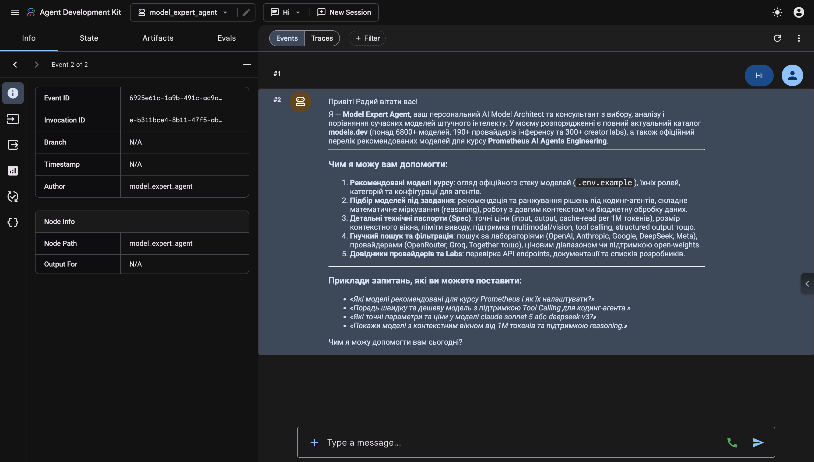

# ADK Go v2 Model Expert Agent (з підтримкою pimodels та models.dev)

Приклад інтелектуального агента на **Google Agent Development Kit (ADK) Go v2** з підтримкою **multi-provider LLM** через пакет [`pimodels`](https://github.com/dimetron/pi-go/tree/main/pimodels) (`github.com/dimetron/pi-go/pimodels`) та вбудованим каталогом [`models.dev`](https://models.dev) (`resources/models.json`).

Агент **Model Expert** виступає в ролі AI Model Architect: аналізує характеристики та ціни, порівнює моделі за контекстним вікном, підтримкою reasoning, tool calling, structured output, open weights, а також рекомендує оптимальні моделі під конкретні технічні завдання (кодинг, математика, аналіз документів, дешевий інференс тощо). Працює як в **інтерактивній консолі**, так і у **веб-інтерфейсі (Web UI)**.

---

## 🛠 Доступні інструменти агента (ADK Function Tools)

Вбудований каталог індексує понад **6 800+ моделей** від **190+ провайдерів** та **300+ лабораторій**:

| Інструмент | Опис |
|---|---|
| `list_models` | Пошук та фільтрація моделей за текстом, провайдером, лабораторією (`lab`), сімейством, `reasoning`, `tool_call`, `open_weights`, мінімальним контекстом (`min_context`) та максимальною ціною (`max_input_cost`). |
| `list_providers` | Список провайдерів інференсу (OpenRouter, Groq, Together, HPC-AI, OpenAI тощо) з URL API та посиланнями на документацію. |
| `list_labs` | Список лабораторій-творців моделей (OpenAI, Anthropic, Google, DeepSeek, Meta, Mistral AI, Moonshot AI, Alibaba Qwen тощо) з кількістю моделей та основними сімействами. |
| `get_model_details` | Повні специфікації моделі: ліміт контексту, вихідних токенів, точна вартість input/output/cache per 1M tokens, reasoning опції, модальності, дати релізу. |
| `recommend_models` | Автоматичне ранжування та підбір найкращих моделей під конкретну задачу з поясненням критеріїв вибору (`fit_reason`). |

---

## 🚀 Швидкий старт (2 хвилини)

### 1. Створіть файл конфігурації `.env`

```bash
cp .env.example .env
```

### 2. Вкажіть API-ключ вашого провайдера

```bash
# Google Gemini (за замовчуванням):
GEMINI_API_KEY=AIzaSy...
# MODEL=gemini-3.7-flash

# Anthropic Claude:
# ANTHROPIC_API_KEY=sk-ant-...
# MODEL=claude-haiku-4.5
# MODEL=claude-sonnet-5

# OpenAI:
# OPENAI_API_KEY=sk-proj-...
# MODEL=gpt-5.6-luna
# MODEL=gpt-4o

# Локальна Ollama:
# MODEL=ollama/deepseek-v4-flash:0731
# MODEL=ollama/llama3
```

---

## 💬 Запуск агента

### Варіант A: Інтерактивний консольний режим

Запустіть агента через `make` або `go run`:

```bash
make run
# або: go run .
```

#### Приклади діалогу в консолі:

```text
User  -> Які топ лабораторії (labs) є в каталозі?
Agent -> У каталозі зареєстровано понад 300 лабораторій. Найбільші з них:
         1. OpenAI (650+ моделей) — сімейства gpt, o-series
         2. Google (310+ моделей) — сімейство gemini
         3. Qwen / Alibaba (280+ моделей) — сімейства qwen, qwen-coder
         4. Anthropic (200+ моделей) — сімейства claude-sonnet, claude-opus, claude-haiku
         5. DeepSeek (130+ моделей) — сімейства deepseek-flash, deepseek-thinking

User  -> Порадь дешеву модель для кодинг-агента з підтримкою tool calling і контекстом від 128k токенів.
Agent -> Рекомендую такі варіанти:
         1. DeepSeek V4 Flash (DeepSeek / HPC-AI) — 1M context, tool_call=true, reasoning=true, вартість $0.14 input / $0.28 output за 1M токенів (open weights).
         2. Kimi K2.7 Code (Moonshot AI) — 256k context, спеціалізована для тривалої роботи в репозиторіях, $0.95 input / $4.00 output.
         3. Claude Haiku 4.5 (Anthropic) — 200k context, швидкий та точний tool use, $1.00 input / $5.00 output.

User  -> Які параметри та вартість у anthropic/claude-opus-4.7?
Agent -> Claude Opus 4.7 (Anthropic):
         - Контекстне вікно: 1 000 000 токенів (1M)
         - Макс. вихід: 128 000 токенів
         - Вартість: $5.00 / 1M input, $25.00 / 1M output, $0.50 / 1M cache read
         - Можливості: Reasoning (effort: low/medium/high), Tool Call, Multimodal (Text + Image).
```

### Варіант B: Веб-інтерфейс (Web UI)

ADK v2 має вбудований повнофункціональний веб-інтерфейс. Запустіть його командою:

```bash
make run-web
# або: task run-web
# або: go run . web webui api
```

Після запуску відкрийте браузер за адресою:
👉 **http://localhost:8080/ui/**

У веб-інтерфейсі доступний інтерактивний чат з агентом, перемикання сесій, перегляд викликів інструментів (Function Calls), стан агентів (State & Artifacts) та повне трасування подій (Event Traces):



---

## 🏗 Як влаштований агент

1. **Вбудований каталог (`//go:embed resources/models.json`)**:
   Файл з повною базою моделей компілюється безпосередньо в бінарний файл через механізм `go:embed`. При старті `catalog.Store` створює швидкі індекси в пам'яті.

2. **Декларативні інструменти ADK v2 (`functiontool.New`)**:
   Усі схеми інструментів автоматично виводяться з типізованих Go-структур (`ListModelsInput`, `GetModelDetailsInput`, `RecommendModelsInput` тощо).

3. **Multi-provider LLM через `pimodels`**:
   Будь-яка обрана модель (Gemini, Claude, GPT, Ollama) повертається як `pimodels.Model`, що реалізує інтерфейс ADK `model.LLM`.

---

## 🛠 Корисні команди (`make` або `task`)

Проєкт підтримує як класичний `make`, так і сучасний [Taskfile](https://taskfile.dev/):

| `make` команда | `task` команда | Опис |
|---|---|---|
| `make help` | `task` (або `task --list`) | Показати перелік усіх доступних команд |
| `make run` | `task run` | Запустити агента в інтерактивній консолі (`go run .`) |
| `make run-web` | `task run-web` | Запустити веб-інтерфейс (Web UI) на порту 8080 |
| `make build` | `task build` | Скомпілювати бінарні файли у `bin/` (`bin/adk-quickstart`, `bin/login`) |
| `make test` | `task test` | Запустити модульні та офлайн-тести |
| `make vet` | `task vet` | Запустити аналізатор коду `go vet` |
| `make verify` | `task verify` | Повна перевірка: форматування, vet, тести, компіляція |
| `make login-codex` | `task login-codex` | Увійти через OpenAI Codex Device Flow (запускає `cmd/login codex`) |
| `make login PROV=...` | `task login PROV=...` | Увійти через OAuth/Device (наприклад: `task login PROV=opencode`) |

> **Примітка:** Додаток автоматично підвантажує змінні з локального файлу `.env` при запуску, навіть якщо ви запускаєте `go run .` напряму.

